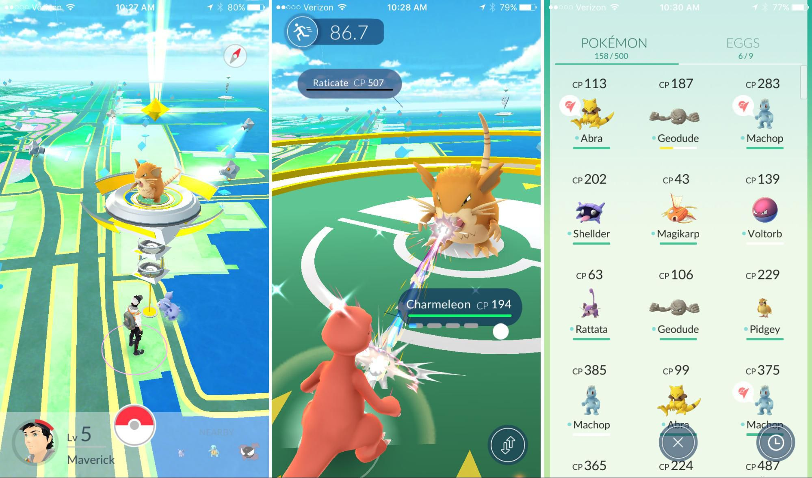
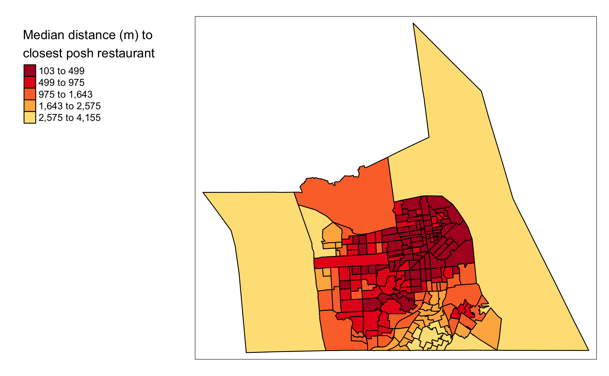

Where do Pokemon spawn?
================

# 0 Startup

This ReadMe file is the main presentation of results from my project.
The other folders are:

-   GIS3Code: Contains all code, R and SQL, used in this project. I
    annotate my code with some some high-level comments if you are
    interested.
-   GIS3RawData: Raw data directly downloaded from the relevant
    locations.
-   GIS3SpatialRawData: Spatialized and cleaned versions of the raw data
    (e.g. `csv` of long lats to a `shapefile`)
-   GIS3CartoProcessedData: CARTO (`PostGIS`) processed versions of the
    spatialized raw data.
-   FinalData: Final datasets used for analysis
-   GIS3CartoWranglingPics: Pictures of the CARTO (`PostGIS`) data
    wrangling process.
-   GIS3ExploratoryPics: Pictures of exploratory visualizations
-   GIS3Regressions: Text files of regressions ran on the data through
    `GeoDaSpace`
-   GIS3PointPattern: Pictures of point pattern analysis results
-   GIS3OtherPics: Other pictures relevant to the analysis
-   GIS3WorksCited: Works Cited

# 1 Introduction. Some background and motivation.

Pokemon Go is a popular mobile game in which players travel across
different real-world locations to collect material at PokeStops and
catch Pokemon that spawn. The game’s user interface presents the player
with different Pokestop locations and Pokemons, all tagged onto a
real-world map. Here’s a snapshot of the UI.

#### Figure 1.1: Pokemon GO UI

As a once avid Pokemon Go player, I noticed some very unusual and
geographically interesting features of the game. For example, when I
lived in the Philippines, I realized all the Pokestops and Pokemon were
clustered in the CBD, so it was very difficult to progress in the game
unless you lived there. That explains why hordes of teenagers descend
onto the CBD every weekend. The University of Chicago is a hotspot of
Pokemon Go, but if you go out further, you won’t be progressing very
fast. The central component of this game is the *spatial component*, and
any progress in the game is spatially constrained.

Thus, I want to explore the following research question: **What
covariates are most strongly associated with the spatial intensity of
Pokemon Go spawns?**

Methodologically, this exploration of Pokemon Go may justify its use as
a proxy or instrumental variable in various studies of subjects from
neighborhood segregation to spatial submarkets. Thematically, the paper
provides insight into how the merging of virtual and geographic spaces
may lead to more systematic biases.

# 2 Literature review

You can find my citations in the *GIS3WorksCited* folder.

Pokemon Go is a relatively new game, but a variety of papers have
studied how pokemon spawn and what are the implicitly spatial biases in
the game. Out of the many papers I’ve reviewed, three have most
motivated my study approach

The paper that thematically motivated my exploration was by Colley et.
al. The authors claimed that applications like Pokemon Go have
implications that go beyond the virtual world. “Geographic
Human-Computer-Interaction (HCI) can remake place, often in a fashion
that reinforces pre-existing power structures”. If Pokemon Go might
“remake a place” to reinforce pre-existing structures, then the choice
of pokemon spawn locations might also be heavily influenced by
pre-existing spatial disparaites. Operationally, the paper pointed that
ethnicity was a key covariate of Pokemon Go spatial density. So I’ll be
on the lookout for whether if a similar pattern exists.

While Colley et. al (2017) inspired the general direction of my study,
Sari (2020) analyzes the association between the spatial density of
Pokemon Go stops and disparities in neighborhoods (specifically
disparities in amenities). I’ve extensively used this paper to roadmap
my analytical techniques because it provides the most methodologically
rigorous discussion of Pokemon Go. Specifically, it offers guidance on
the types of regressors to select (e.g. unemployment, rent) and a
baseline spatial econometric specification.

Finally, Juhász et al’s study provides a reference for the appropriate
level of spatial aggregation for a study on Pokemon Go. It conducts the
analysis at the “US Census Block Group level” because “this aggregation
level…avoids too many zero-count areas while still providing a
sufficient sample size and a detailed enough spatial granularity to
capture local variability in socioeconomic variables.” Simiarly, I chose
to set my spatial scale at the Census Tract level because it provided
enough local variability and had much existing data.

# 3 Goals and objectives

The research question, again, is: **What covariates are most strongly
associated with the spatial intensity of Pokemon Go spawns?**

My solution to this question is roadmapped below.

1.  **Model selection.** Define a sensible dependent variable and
    regressors
2.  **Data collection and wrangling.** Use R to mutate basic and CARTO
    (‘PostGIS’ specifically)
3.  **Exploratory spatial data analysis**. Map out the key spatial
    patterns of the most interesting dependent and independent variables
    to build some intuition.
4.  **Spatial econometric regression**. A spatial lag model is used to
    to identify spatial autocorrelation in the relationship between
    regressors and the Pokemon Go outcome variable.
5.  **Point pattern analysis of Pokemon Go spawn locations**. This
    analysis will examine whether if simple spatial autocorrelation in
    spawn locations, rather than systematic neighborhood
    characteristics, are more associated with the spatial intensity of
    Pokemon Go spawns.

